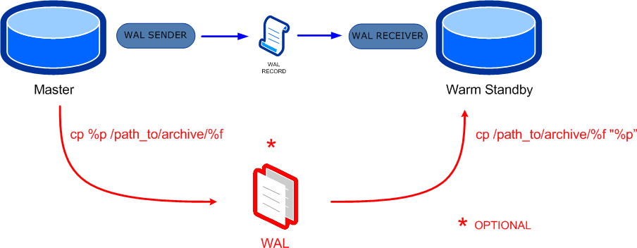

# Práctica 5. Replicación
## Objetivo
Al finalizar la práctica, serás capaz de:
-  Practicar lo que es la replicación lógica para una mejor disponibilidad de la aplicación.

## Duración aproximada
- 120 minutos.

## Objetivo visual
En la siguiente práctica, verás cómo realizar una replicación lógica de base de datos con PostgreSQL.



## Instrucciones

### Tarea 1. Configurar la replicación del maestro-esclavo local

**Requisitos**
-	PostgreSQL 16 instalado (versión 13 o superior recomendada).
-	Dos directorios para los datos:

    `/var/lib/postgresql/maestro` (puede ser el `main` de un `cluster` normal).

    `/var/lib/postgresql/esclavo` (puedes llamarle `replica`).
-	Puertos separados: 5432 (maestro), 5433 (esclavo).
-	Cambia el puerto del servidor`main` al puerto 5431 o desde el usuario privilegiado da de baja el servidor `main`.

**Paso 1.** Crea los directorios de datos.
```
- Desde el usuario privilegiado dar los siguientes comandos:

sudo mkdir -p /var/lib/postgresql/maestro
sudo mkdir -p /var/lib/postgresql/esclavo
sudo chown -R postgres:postgres /var/lib/postgresql
```
**Paso 2.** Entra a la cuenta de `postgres` e inicializa el maestro.
```
sudo -i -u postgres

/usr/lib/postgresql/16/bin/initdb -D /var/lib/postgresql/maestro
```

**Paso 3.** Configura el `postgresql.conf` del maestro.

Edita el siguiente archivo `/var/lib/postgresql/maestro/postgresql.conf`:

`nano /var/lib/postgresql/maestro/postgresql.conf`

Agrega o ajusta los siguientes parámetros:
```
port = 5432
wal_level = replica
max_wal_senders = 10
wal_keep_size = 64MB
listen_addresses = '*'
```

**Paso 4.** Configura el `pg_hba.conf` del maestro.

```
nano /var/lib/postgresql/maestro/pg_hba.conf
```

Agrega al final del archivo la siguiente línea:
```
host replication replicador 127.0.0.1/32 md5
```

**Paso 5.** Arranca el servidor `maestro`y crea un usuario para replicación y otórgale privilegios.

Inicia el maestro en segundo plano:
```
/usr/lib/postgresql/16/bin/pg_ctl -D /var/lib/postgresql/maestro -l maestro.log start
```
Crea el usuario replicador:

- Conéctate con al usuario `postgres` del maestro:
  
`psql -p 5432 -U postgres`

```sql
- Crea el role y otórgale privilegios:

CREATE ROLE replicador WITH REPLICATION LOGIN ENCRYPTED PASSWORD 'abc123';
GRANT USAGE ON SCHEMA public TO replicador;
GRANT SELECT ON ALL TABLES IN SCHEMA public TO replicador;
\q
```

**Paso 6.** Inicializa el esclavo con `pg_basebackup`.

Ejecuta el siguiente comando para realizar una copia del `maestro` al `esclavo`:
```
pg_basebackup -h 127.0.0.1 -p 5432 -D /var/lib/postgresql/esclavo -U replicador -Fp -Xs -P -R
```
Esto creará un archivo `standby.signal` automáticamente en el directorio del esclavo.


**Paso 7.** Configura el esclavo (`postgresql.conf`).
```
nano /var/lib/postgresql/esclavo/postgresql.conf
```

Asegúrate de tener la siguiente configuración:
```
port = 5433
hot_standby = on
```

**Paso 8.** Inicia el servidor esclavo.
```
/usr/lib/postgresql/15/bin/pg_ctl -D /var/lib/postgresql/esclavo -l esclavo.log start
```

**Paso 9.**  Verifica la replicación.
```
- Conéctate al servidor `maestro` y ejecuta el siguiente `SELECT`.

psql -p 5432
SELECT * FROM pg_stat_replication;

- Crea una tabla con datos y despues verifica que haya sido replicada en el esclavo.

create table pruebas(dato int);
insert into pruebas values (1),(2),(3),(10);
select * from pruebas;
\q

- Conéctate al servidor esclavo y verifica la replicación.

psql -p 5433
select * from pruebas;
\q
```

**Paso 10.** Comprueba que el maestro y el esclavo están en ejecución desde la línea de comandos.
```
- Desde el usuario `postgres` ejecuta el siguiente comando, deberás ver los dos servidores en ejecución:

- ps -ef|grep postgresql
```

### Tarea 2. (Opcional) Probar `failover` manual
Simula la caída del maestro y promueve el esclavo a maestro.

**Paso 1.** Detén al maestro.
```
/usr/lib/postgresql/15/bin/pg_ctl -D /var/lib/postgresql/maestro stop
```

**Paso 2.** Promueve al esclavo.
```
/usr/lib/postgresql/15/bin/pg_ctl -D /var/lib/postgresql/esclavo promote
```

**Paso 3.** Valida la promoción.

Intenta conectarte y escribe en la réplica, ahora promovida:
```
psql -p 5433
```
```sql
CREATE TABLE test_failover(id INT);
INSERT INTO test_failover VALUES (1);
SELECT * FROM test_failover;
```
## Resultado esperado
**Monitoreo del estado de la replicación**
 
### Conclusión
¡Has configurado exitosamente la replicación física en PostgreSQL 16 en un entorno local!
```
- maestro (5432): envía cambios.
- esclavo (5433): recibe cambios en tiempo real.
```
